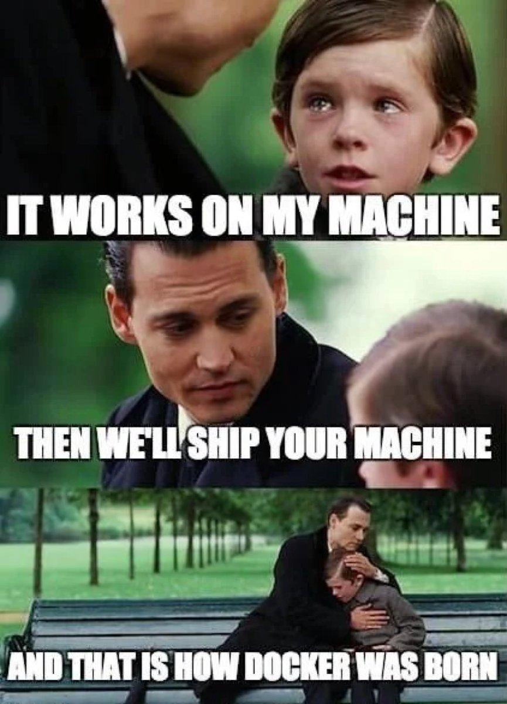

<p align="center">
  
</p>

# Docker

> From "it works on my machine" to "it works everywhere" — containerize all the things! 🐳

---

## 📝 Description

This project is a step-by-step introduction to Docker and containerization. Starting from a simple "Hello, World!" Docker image, I progressively built a complete web infrastructure composed of a Flask back-end API, a static Nginx front-end, a reverse proxy server, and a load balancer using the Round-Robin algorithm — all orchestrated with Docker Compose. Each task builds on the previous one, going from a single container to a fully scaled multi-container architecture. By the end, I had a real-world-inspired deployment setup running locally, with multiple API servers handling traffic in parallel.

---

## 🎯 Learning Objectives

By completing this project, I am able to explain what Docker is and why it solves the classic "it works on my machine" problem. I understand the difference between a Docker image and a Docker container, and I know how to write a Dockerfile to build a custom image from scratch. I am able to use core Docker commands such as `docker build`, `docker run`, `docker ps`, `docker logs`, and `docker exec` to manage my containers. I understand how Docker Compose works and how to write a `docker-compose.yml` file to orchestrate multiple services simultaneously. I know how Docker's internal DNS resolves service names within a Compose network, and I understand the difference between `ports:` and `expose:` for managing port visibility. I am able to configure Nginx as both a reverse proxy and a load balancer using the Round-Robin algorithm, and I know how to scale a service horizontally using the `--scale` flag in Docker Compose.

---

## 🛠️ Technologies Used

This project uses **Docker** and **Docker Compose** as the core tools for containerization and orchestration. The back-end API is built with **Python 3** and the **Flask** micro-framework, extended with **flask-cors** to handle cross-origin requests. The front-end static content server and the reverse proxy are both powered by **Nginx**. The base system image used throughout is **Ubuntu (latest)**.

---

## ⚙️ Requirements

- OS: Ubuntu 20.04 LTS (or any system with Docker installed)
- Docker Engine installed and running
- Docker Compose v2+ (`docker compose` syntax)
- Python 3 (inside the container — no local Python required)
- All files must end with a new line
- A `README.md` at the root of the project is mandatory
- No hardcoded IP addresses — service names from `docker-compose.yml` are used for internal routing

---

## 🚀 Installation

```bash
git clone https://github.com/GwenP88/holbertonschool-softy-pinko-docker
cd holbertonschool-softy-pinko-docker
```

---

## ▶️ Usage / Execution

### Single container (tasks 0 and 1)

Build and run a single Docker image:

```bash
# Build the image
docker build -f ./Dockerfile -t softy-pinko:task0 .

# Run the container
docker run -it --rm --name softy-pinko-task0 softy-pinko:task0
```

### Multi-container with Docker Compose (tasks 4, 5, 6)

```bash
# Build all services
docker compose build

# Start all services in the background
docker compose up -d

# View logs in real time
docker compose logs -f

# Stop and remove containers
docker compose down
```

### Scale the back-end horizontally (task 6)

```bash
# Launch with 2 back-end instances
docker compose up --scale back-end=2

# Launch with 5 back-end instances
docker compose up --scale back-end=5
```

### Access the application

| Service | URL |
|---|---|
| Full app (via proxy) | `http://localhost:80` |
| Front-end only (tasks 2-3) | `http://localhost:9000` |
| Back-end only (task 1) | `http://localhost:5252/api/hello` |

---

## 📊 Project Progress

<p align="center">

</p>

<p align="center">
<sub>Mandatory tasks completion: 100%</sub>
</p>

---

## ✨ Features

---

### Task 0 — Create Your First Docker Image

- **Status:** Mandatory
- **Objective:** Write a first Dockerfile based on Ubuntu, update and upgrade the system, and output "Hello, World!" when the container runs.
- **Constraint:** Must use `ubuntu:latest` as the base image. APT must be updated and upgraded inside the image.
- **Expected behavior:** Running the container prints `Hello, World!` in the terminal and exits cleanly.

**Commands to build and test:**

```bash
cd task0
docker build -f ./Dockerfile -t softy-pinko:task0 .
docker run -it --rm --name softy-pinko-task0 softy-pinko:task0
# Expected output: Hello, World!
```

**Files:** `Dockerfile`

---

### Task 1 — Back-end

- **Status:** Mandatory
- **Objective:** Extend the task0 image to install Python3, pip3, and Flask, then serve a Flask API with one endpoint `/api/hello` that returns `"Hello, World!"`.
- **Constraint:** Flask must be installed via `pip3`, not `apt-get`. The app must run on `0.0.0.0:5252`. The `-y` flag is required on all `apt-get` commands. If an `EXTERNALLY-MANAGED` error occurs, add `RUN rm /usr/lib/python*/EXTERNALLY-MANAGED` before the pip install.
- **Expected behavior:** The container starts a Flask server. Visiting `http://localhost:5252/api/hello` returns `Hello, World!`.

**Commands to build and test:**

```bash
cd task1
docker build -f ./Dockerfile -t softy-pinko:task1 .
docker run -p 5252:5252 -it --rm --name softy-pinko-task1 softy-pinko:task1
# In a browser or with curl:
curl http://localhost:5252/api/hello
# Expected output: Hello, World!
```

**Files:** `Dockerfile`, `api.py`

---

### Task 2 — Front-end

- **Status:** Mandatory
- **Objective:** Create a front-end static content server using Nginx. The project is reorganized into `back-end/` and `front-end/` subdirectories. The front-end clones the `softy-pinko-front-end` repository and serves it via Nginx on port 9000.
- **Constraint:** The front-end Dockerfile must use `nginx:latest`. Static files must be copied to `/var/www/html/softy-pinko-front-end`. An Nginx config file `softy-pinko-front-end.conf` must be copied to `/etc/nginx/conf.d/default.conf`. The server must listen on port 9000.
- **Expected behavior:** Running the front-end container and visiting `http://localhost:9000` displays the Softy Pinko landing page.

**Commands to build and test:**

```bash
cd task2
docker build -f ./front-end/Dockerfile -t softy-pinko-front-end:task2 ./front-end
docker run -p 9000:9000 -it --rm --name softy-pinko-front-end-task2 softy-pinko-front-end:task2
# Open http://localhost:9000 in a browser
```

**Files:** `front-end/Dockerfile`, `front-end/softy-pinko-front-end.conf`, `back-end/Dockerfile`, `back-end/api.py`

---

### Task 3 — Connecting the Front-end and Back-end

- **Status:** Mandatory
- **Objective:** Connect the front-end to the back-end so that dynamic data from the Flask API appears on the web page. A `<h1 id="dynamic-content">` element is added to `index.html`, populated via a jQuery AJAX call to the back-end. `flask-cors` is added to the back-end to allow cross-origin requests.
- **Constraint:** The JavaScript must call `http://localhost:5252/api/hello`. The script tag must be placed just before the closing `</body>` tag. `flask-cors` must be installed via `pip3` in the back-end Dockerfile.
- **Expected behavior:** With both containers running simultaneously, the landing page displays `Hello, World!` fetched dynamically from the Flask API.

**Commands to build and test:**

```bash
cd task3

# Terminal 1 — back-end
docker build -f ./back-end/Dockerfile -t softy-pinko-back-end:task3 ./back-end
docker run -p 5252:5252 -it --rm --name softy-pinko-back-end-task3 softy-pinko-back-end:task3

# Terminal 2 — front-end
docker build -f ./front-end/Dockerfile -t softy-pinko-front-end:task3 ./front-end
docker run -p 9000:9000 -it --rm --name softy-pinko-front-end-task3 softy-pinko-front-end:task3

# Open http://localhost:9000 — "Hello, World!" should appear dynamically on the page
```

**Files:** `back-end/Dockerfile`, `back-end/api.py`, `front-end/Dockerfile`, `front-end/softy-pinko-front-end/index.html`

---

### Task 4 — Making it Simpler with Docker Compose

- **Status:** Mandatory
- **Objective:** Replace the manual multi-terminal workflow with a single `docker-compose.yml` file that defines both the `front-end` and `back-end` services and launches them together.
- **Constraint:** The `docker-compose.yml` must use `build`, `context`, `dockerfile`, `image`, `ports`, and `depends_on` keywords. Port mappings: `9000:9000` for front-end, `5252:5252` for back-end.
- **Expected behavior:** Running `docker compose up` starts both containers. The app is accessible at `http://localhost:9000` with dynamic content.

**Commands to build and test:**

```bash
cd task4
docker compose build
docker compose up
# Open http://localhost:9000
# To stop:
docker compose down
```

**Files:** `docker-compose.yml`, `back-end/Dockerfile`, `back-end/api.py`, `front-end/Dockerfile`, `front-end/softy-pinko-front-end.conf`, `front-end/softy-pinko-front-end/index.html`

---

### Task 5 — Proxy Server

- **Status:** Mandatory
- **Objective:** Add a reverse proxy server (Nginx) in front of the front-end and back-end. All client traffic goes through the proxy on port 80. The proxy routes `/api` requests to the back-end and all other requests to the front-end. The JavaScript in `index.html` is updated to call `/api/hello` (relative URL) instead of the direct back-end address.
- **Constraint:** A `proxy/` directory must be created with its own `Dockerfile` and `proxy.conf`. The proxy must listen on port 80. Only the proxy service exposes a port to the host (`80:80`). Front-end and back-end ports must NOT be mapped to the host — they are only reachable internally. Docker's internal DNS resolves service names automatically.
- **Expected behavior:** Visiting `http://localhost:80` shows the full app. Direct access to `localhost:9000` or `localhost:5252` is blocked.

**Commands to build and test:**

```bash
cd task5
docker compose build
docker compose up
# Open http://localhost (port 80)
# Verify proxy routing:
curl http://localhost/api/hello        # Should return: Hello, World!
curl http://localhost/                 # Should return the HTML page
# Verify direct access is blocked:
curl http://localhost:9000             # Should fail / connection refused
curl http://localhost:5252/api/hello   # Should fail / connection refused
# To stop:
docker compose down
```

**Files:** `docker-compose.yml`, `proxy/Dockerfile`, `proxy/proxy.conf`, `back-end/Dockerfile`, `back-end/api.py`, `front-end/Dockerfile`, `front-end/softy-pinko-front-end.conf`, `front-end/softy-pinko-front-end/index.html`

---

### Task 6 — Scale Horizontally

- **Status:** Mandatory
- **Objective:** Scale the back-end to multiple instances using `docker compose up --scale`. Nginx automatically load-balances requests between all instances using the Round-Robin algorithm. The exact command used to spin up 2 back-end servers must be saved in `2-api-servers.txt`.
- **Constraint:** The back-end service must be named `back-end` in `docker-compose.yml`. It must NOT use a fixed `ports:` mapping (use `expose:` instead) to allow multiple instances to run without port conflicts. The `2-api-servers.txt` file must end with a newline.
- **Expected behavior:** With 2 back-end instances running, reloading the page repeatedly shows the requests alternating between `task6-back-end-1` and `task6-back-end-2` in the logs — proof that Round-Robin is working.

**Commands to build and test:**

```bash
cd task6

# Launch with 2 back-end instances
docker compose up --scale back-end=2

# In another terminal, watch the logs to verify Round-Robin:
docker compose logs -f back-end
# Reload http://localhost several times and observe alternating back-end-1 / back-end-2

# Test with curl in a loop:
for i in {1..6}; do curl -s http://localhost/api/hello; echo; done

# Launch with 5 back-end instances (optional test)
docker compose up --scale back-end=5

# To stop:
docker compose down
```

**Files:** `docker-compose.yml`, `2-api-servers.txt`, `proxy/Dockerfile`, `proxy/proxy.conf`, `back-end/Dockerfile`, `back-end/api.py`, `front-end/Dockerfile`, `front-end/softy-pinko-front-end.conf`, `front-end/softy-pinko-front-end/index.html`

---

## 🤝 Contributions & Acknowledgements

Big thanks to the Holberton School team for designing a project that actually makes Docker click — nothing beats building a real load-balanced infrastructure to understand why containers exist. Thanks also to the open-source communities behind Docker, Nginx, Flask, and everyone who ever wrote a Stack Overflow answer about a cryptic Docker error at 2am. You know who you are. 🙏

---

## 👤 Author

**Gwenaelle PICHOT**
- Student at Holberton School
- Track: Concepteur Développeur d'Applications — Fondamentaux
- Project: Docker